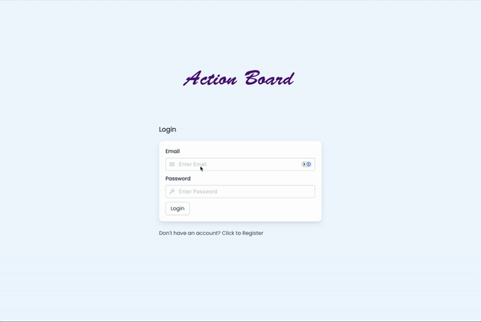
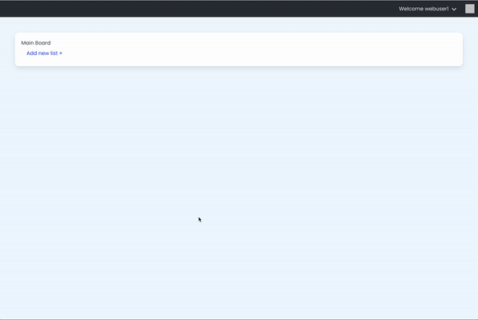
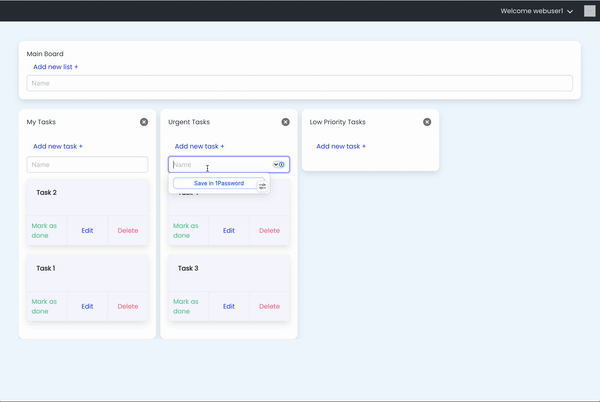
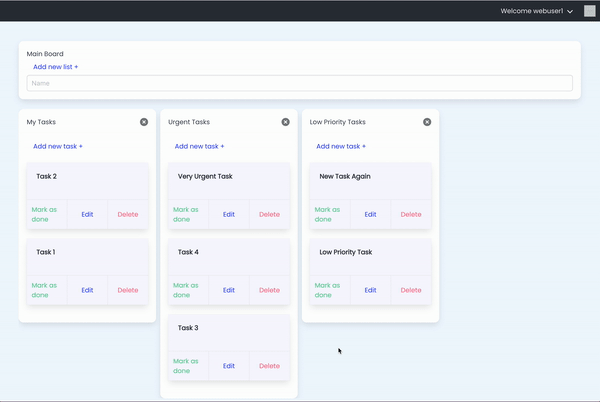
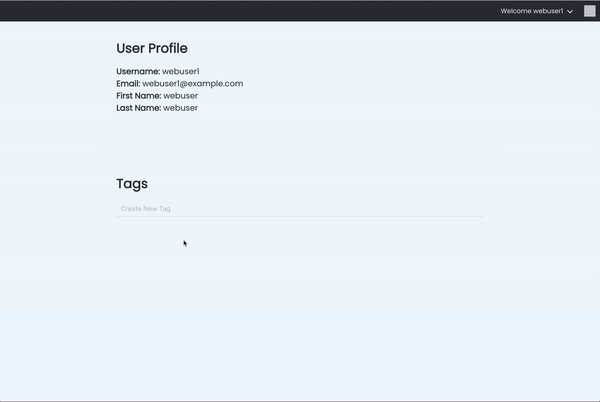

# Action Board

GA SEI: Project 4

## Table of Contents

- [Introduction](#introduction)
- [Features](#features)
- [Installation](#installation)
- [Usage](#usage)
- [Future Improvements](#future-improvements)

## Introduction

Action Board is a task management board designed to help individuals organize tasks, track progress, and work more effectively. This project was developed as part of General Assembly's Software Engineering Immersive (SEI) program.

This project communicates with a separate backend hosted on heroku for data manipulation and storage. _You can find the [backend deployment here](https://github.com/ladeoshodi/action-board-api)_

## Live Project

[Play with the live project here](https://action-board.netlify.app)

## Technologies

- ReactJS
- TypeScript
- BulmaCSS
- Vite

## Features

- User authentication
  

- Task creation and editing
  

  

- Drag-and-drop task management
  

- Tags Management
  

## Installation

1. Clone the repository:

   ```sh
   git clone https://github.com/yourusername/action-board.git
   cd action-board
   ```

2. Install dependencies:

   ```sh
   npm install
   ```

3. Create a `.env` file in the root directory and add your environment variables:

   ```sh
   touch .env
   ```

4. Set environment variable for the proxy server

   ```sh
   VITE_APP_URL=/api
   ```

5. Start the development server:
   ```sh
   npm run dev
   ```

## Usage

Open your browser and navigate to `http://localhost:5173` to start using the Action Board.

## Future Improvements

_Possible additional improvements to the project._

- Enable Users to edit a task column name
- Enable Users to drag and drop task columns in any order
- Enable Users to update their personal details
- Enable Users upload images
- Enable Users to filter/search by task tags/name
- Signup email confirmation
- Forgot password flow
- Allow Users to switch from a horizontal to a vertical view of the board
